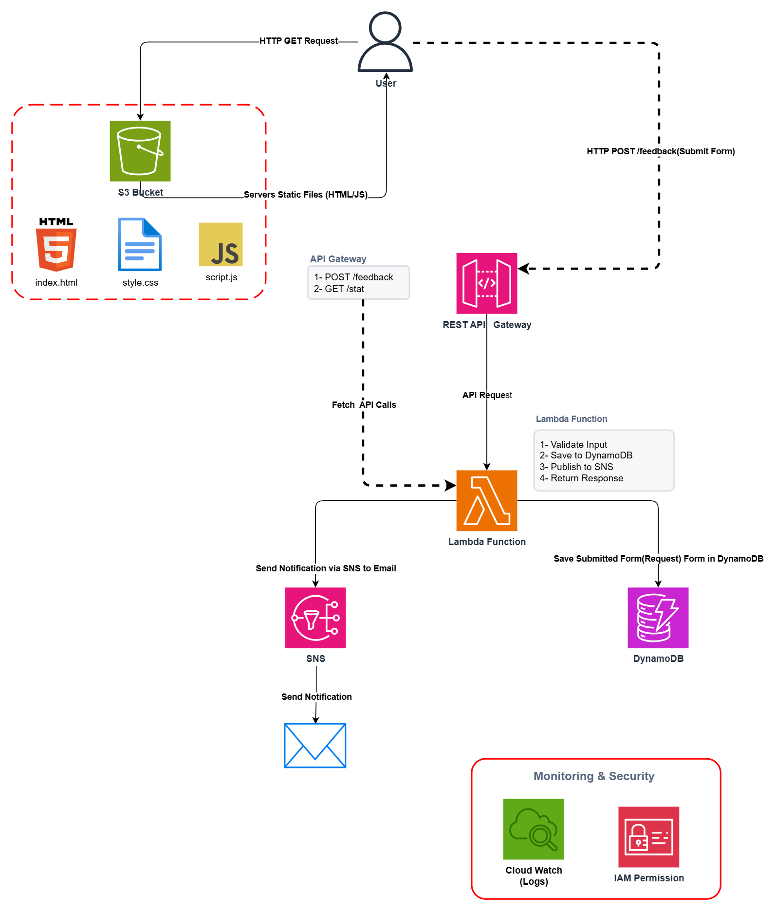

# 💬  AWS Serverless Feedback & Contact Form 

<p align="center">
  
  
  
 

AWS Serverless Feedback & Contact Form is a cloud-native, fully serverless application for collecting and managing user feedback. It uses `Amazon S3` and `CloudFront` for secure frontend delivery, `API Gateway` and `AWS Lambda` for backend processing, and `DynamoDB` and `SNS` for data storage and real-time email notifications—without the need for traditional servers or EC2.


## 📋 Table of Contents

- [Overview](#-overview)
- [Architecture](#-architecture)
- [AWS Services](#-aws-services)
- [Project Structure](#-project-structure)
- [Deployment Steps](#-deployment-steps)
- [Testing](#-testing)
- [Troubleshooting](#-troubleshooting)
- [Cost Estimate](#-cost-estimate)
- [Cleanup](#-cleanup)


## 🎯 Overview

**FeedbackHub** is a production-ready serverless contact form built entirely on AWS. Users fill out a form, their message is saved to DynamoDB, and the site owner receives an instant email notification via SNS — all without managing any servers.

### ✨ Features

- ✅ Real-time form submission with loading state
- ✅ Instant email notification to site owner
- ✅ Message counter showing total submissions
- ✅ Input validation on both client and server side
- ✅ HTTPS via CloudFront
- ✅ 100% Serverless — zero server management
- ✅ Runs entirely on AWS Free Tier


## 🏗️ Architecture




## ☁️ AWS Services

| Service | Role | Free Tier Limit |
|---|---|---|
| **Amazon S3** | Hosts the static frontend | 5GB + 20K GETs/month |
| **Amazon CloudFront** | CDN + HTTPS delivery | 1TB transfer/month |
| **Amazon API Gateway** | REST API endpoints | 1M requests/month (1st year) |
| **AWS Lambda** | Backend business logic | 1M invocations/month |
| **Amazon DynamoDB** | Stores all messages | 25GB + 200M requests/month |
| **Amazon SNS** | Email notifications | 1,000 emails/month |
| **AWS IAM** | Lambda permissions | Always free |


## 📁 Project Structure

```
feedback-project/
│
├── frontend/
│   ├── index.html       # Contact form UI
│   ├── style.css        # Styles and responsive design
│   └── script.js        # API calls and form logic
│
├── lambda/
│   └── lambda_function.py   # Handles POST /feedback & GET /stats
│
└── README.md
```

## 🚀 Deployment Steps


### Step 1 — Create DynamoDB Table

1. Open [AWS Console](https://console.aws.amazon.com) → search **DynamoDB**
2. Click **Create table**
3. Fill in:
   - **Table name:** `feedback-messages`
   - **Partition key:** `message_id` → type: **String**
4. Under **Table settings** → choose **Customize settings**
5. **Capacity mode:** On-demand
6. Click **Create table**
7. Wait until status shows **Active** ✅

---

### Step 2 — Create SNS Topic & Confirm Email

**Create the topic:**

1. Search **SNS** → **Topics** → **Create topic**
2. **Type:** Standard
3. **Name:** `feedback-notifications`
4. Click **Create topic**
5. **Copy and save the ARN** — looks like:
   ```
   arn:aws:sns:us-east-1:YOUR_ACCOUNT_ID:feedback-notifications
   ```

**Subscribe your email:**

6. Click **Create subscription**
7. **Protocol:** Email
8. **Endpoint:** your email address
9. Click **Create subscription**
10. Check your inbox → click **Confirm subscription** in the AWS email
11. Verify status shows **Confirmed** ✅

---

### Step 3 — Create IAM Policy & Role

**Create the Policy:**

1. Search **IAM** → **Policies** → **Create policy**
2. Click the **JSON** tab → paste:

```json
{
  "Version": "2012-10-17",
  "Statement": [
    {
      "Effect": "Allow",
      "Action": [
        "logs:CreateLogGroup",
        "logs:CreateLogStream",
        "logs:PutLogEvents"
      ],
      "Resource": "*"
    },
    {
      "Effect": "Allow",
      "Action": [
        "dynamodb:PutItem",
        "dynamodb:Scan"
      ],
      "Resource": "arn:aws:dynamodb:*:*:table/feedback-messages"
    },
    {
      "Effect": "Allow",
      "Action": "sns:Publish",
      "Resource": "*"
    }
  ]
}
```

3. Click **Next**
4. **Policy name:** `feedback-lambda-policy`
5. Click **Create policy**

**Create the Role:**

6. **IAM** → **Roles** → **Create role**
7. **Trusted entity:** AWS service → **Lambda**
8. Click **Next**
9. Search for `feedback-lambda-policy` → check it ✅
10. Click **Next**
11. **Role name:** `feedback-lambda-role`
12. Click **Create role**

---

### Step 4 — Create Lambda Function

1. Search **Lambda** → **Create function**
2. Choose **Author from scratch**
3. Fill in:
   - **Function name:** `feedback-handler`
   - **Runtime:** Python 3.12
4. Under **Permissions** → **Change default execution role**
5. Choose **Use an existing role** → `feedback-lambda-role`
6. Click **Create function**

**Upload the code:**

7. In the **Code** tab → open `lambda/lambda_function.py` in VSCode
8. Select all (`Ctrl+A`) → copy (`Ctrl+C`)
9. In the Lambda editor → select all → paste → click **Deploy** 🟠

**Set environment variables:**

10. Go to **Configuration** → **Environment variables** → **Edit**
11. Click **Add environment variable** twice:

| Key | Value |
|---|---|
| `TABLE_NAME` | `feedback-messages` |
| `TOPIC_ARN` | your SNS ARN from Step 2 |

12. Click **Save**

**Set timeout:**

13. **Configuration** → **General configuration** → **Edit**
14. **Timeout:** `0 min 15 sec`
15. Click **Save**

---

### Step 5 — Create API Gateway

1. Search **API Gateway** → **Create API**
2. Choose **REST API** → **Build**
3. **API name:** `feedback-api`
4. Click **Create API**

**Create POST /feedback:**

5. **Actions** → **Create Resource**
6. **Resource name:** `feedback` → **Create Resource**
7. With `/feedback` selected → **Actions** → **Create Method** → `POST` → ✓
8. **Integration type:** Lambda Function
9. ✅ Enable **Use Lambda Proxy integration**
10. **Lambda Function:** `feedback-handler`
11. Click **Save** → **OK**
12. **Actions** → **Enable CORS** → **Enable CORS and replace existing CORS headers** → **Yes, replace**

**Create GET /stats:**

13. Click root `/` → **Actions** → **Create Resource**
14. **Resource name:** `stats` → **Create Resource**
15. With `/stats` selected → **Actions** → **Create Method** → `GET` → ✓
16. **Integration type:** Lambda Function
17. ✅ Enable **Use Lambda Proxy integration**
18. **Lambda Function:** `feedback-handler`
19. Click **Save** → **OK**
20. **Actions** → **Enable CORS** → **Enable CORS and replace existing CORS headers** → **Yes, replace**

**Deploy the API:**

21. **Actions** → **Deploy API**
22. **Deployment stage:** `[New Stage]`
23. **Stage name:** `prod`
24. Click **Deploy**
25. **Copy and save the Invoke URL** — looks like:
    
    ```
    https://xxxxxxxxxx.execute-api.us-east-1.amazonaws.com/prod
    ```

---

### Step 6 — Update Frontend Config

1. Open `frontend/script.js` in VSCode
2. On **line 4**, replace:
   
   ```js
   const API_URL = "https://YOUR_API_ID.execute-api.us-east-1.amazonaws.com/prod";
   ```
   with your real Invoke URL:
   ```js
   const API_URL = "https://xxxxxxxxxx.execute-api.us-east-1.amazonaws.com/prod";
   ```
3. Save the file (`Ctrl+S`)

---

### Step 7 — Create S3 Bucket & Upload Files

1. Search **S3** → **Create bucket**
2. **Bucket name:** `feedback-frontend-YOUR_ACCOUNT_ID`
   > Find your Account ID: click your name (top right) in the Console
3. **Region:** us-east-1
4. Under **Block Public Access** → **uncheck** "Block all public access"
5. Confirm the warning checkbox
6. Click **Create bucket**

**Upload files:**

7. Open your bucket → click **Upload** → **Add files**
8. Select all 3 files from VSCode:
   - `frontend/index.html`
   - `frontend/style.css`
   - `frontend/script.js`
9. Click **Upload**

**Enable Static Website Hosting:**

10. Go to **Properties** tab → scroll down → **Static website hosting** → **Edit**
11. **Enable** → Index document: `index.html`
12. Click **Save changes**

**Add Bucket Policy:**

13. Go to **Permissions** tab → **Bucket policy** → **Edit**
14. Paste (replace `YOUR-BUCKET-NAME` with your actual bucket name):

```json
{
  "Version": "2012-10-17",
  "Statement": [{
    "Effect": "Allow",
    "Principal": "*",
    "Action": "s3:GetObject",
    "Resource": "arn:aws:s3:::YOUR-BUCKET-NAME/*"
  }]
}
```

15. Click **Save changes**

---

### Step 8 — Create CloudFront Distribution

1. Search **CloudFront** → **Create distribution**
2. **Origin domain:** select your S3 bucket from the dropdown
3. **Origin access:** Public
4. **Viewer protocol policy:** Redirect HTTP to HTTPS
5. **Default root object:** `index.html`
6. Click **Create distribution**

> ⏳ Wait **5–10 minutes** until Status changes to **Enabled**

7. **Copy the Distribution domain name** — looks like:
   
   ```
   dxxxxxxxxxx.cloudfront.net
   ```

---

### Step 9 — Go Live! 🎉

Open the CloudFront URL in your browser:
```
https://dxxxxxxxxxx.cloudfront.net
```

Your serverless contact form is now live on the internet with HTTPS!


## 🧪 Testing

### Test Lambda directly

In Lambda → **Test** tab → paste this event and click **Test**:

```json
{
  "httpMethod": "POST",
  "path": "/feedback",
  "body": "{\"name\":\"Ahmed Test\",\"email\":\"test@example.com\",\"subject\":\"Hello!\",\"category\":\"general\",\"message\":\"This is a test message from Lambda.\"}"
}
```

**Expected response:**
```json
{
  "statusCode": 200,
  "body": "{\"message_id\": \"uuid-here\", \"message\": \"Your message has been sent successfully!\"}"
}
```

### Test the full flow

| Action | Expected Result |
|---|---|
| Open CloudFront URL | Form loads with modern design |
| Submit empty form | Validation error appears |
| Submit valid form | ✅ Green success message |
| Check your email | Notification email received |
| Open DynamoDB → Explore items | Message saved in table |
| Message counter | Updates to reflect new total |


## 💰 Cost Estimate

| Service | Free Tier Limit | Expected Usage | Cost |
|---|---|---|---|
| Lambda | 1M requests/month | ~500 | **$0** |
| API Gateway | 1M requests/month | ~500 | **$0** |
| DynamoDB | 25GB + 200M requests | < 1MB | **$0** |
| S3 | 5GB storage | < 1MB | **$0** |
| CloudFront | 1TB transfer | Minimal | **$0** |
| SNS | 1,000 emails/month | ~100 | **$0** |

### 💵 Total estimated monthly cost: **$0.00**


## 🧹 Cleanup

To avoid any future charges, delete all resources in this order:

1. **CloudFront** → Disable distribution → wait → Delete
2. **S3** → Empty the bucket → Delete bucket
3. **API Gateway** → Delete `feedback-api`
4. **Lambda** → Delete `feedback-handler`
5. **DynamoDB** → Delete `feedback-messages` table
6. **SNS** → Delete subscription → Delete `feedback-notifications` topic
7. **IAM** → Delete `feedback-lambda-role` → Delete `feedback-lambda-policy`


## 🔮 Future Improvements

- [ ] Add **Amazon Cognito** for admin dashboard with login
- [ ] Add **SES (Simple Email Service)** to send a reply to the user
- [ ] Add **CloudWatch Dashboard** for message analytics
- [ ] Add **rate limiting** in API Gateway to prevent spam
- [ ] Store message **attachments** in S3
- [ ] Add **spam filter** using AWS Comprehend

---
